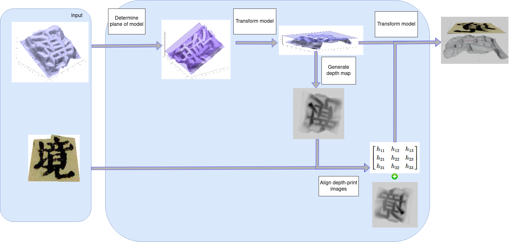

## Alignment of 3D woodblock geometrical models and 2D orthographic projection image

Accurately aligning 3D woodblock geometrical models with 2D orthographic projection images presents a significant challenge in digitally preserving Vietnam’s cultural heritage. This paper proposes a unified image processing algorithm to address this issue, enhancing the registration quality between 3D woodblock models and their 2D representations. The method includes determining the plane of the 3D character model, establishing a transformation matrix to align this plane with the 2D printed image plane, and creating a parallelprojected depth map for precise alignment. This process minimizes disocclusions and ensures that character shapes and strokes are correctly positioned. Experimental results highlight the importance of structure-based comparisons to optimize alignment for large-scale Han-Nom character datasets. The proposed approach, combining density-based and structure-based methods, demonstrates improved registration performance, offering an effective normalization scheme for digital heritage preservation.

  

